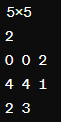
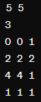

# Campo Minado com Tanque

Este programa implementa um simulador de campo minado com um tanque. Ele cria um campo de jogo com dimensões especificadas pelo usuário e coloca bombas em locais também especificados pelo usuário. O tanque é colocado em uma posição escolhida pelo usuário e verifica se está em uma posição segura ou perigosa.

## Padrão de Entrada

O programa espera a entrada dos dados no seguinte formato:

1. Dimensões do campo de jogo (Linha x Coluna) - por exemplo, `5x5`.
2. Número de bombas a serem colocadas no campo.
3. Para cada bomba:
   - Coordenadas `x, y` da bomba.
   - Raio de explosão da bomba.
4. Coordenadas do tanque e sua resistência.

Por exemplo:

Para o código `campo2`, o padrão de entrada é o mesmo do código `campo1`. No entanto, a última linha de entrada especifica a posição do tanque e sua resistência:

5. Coordenadas `x, y` do tanque.
6. Resistência do tanque.

Por exemplo:

Isso representa um campo de jogo de 5x5 com três bombas nos locais (0,0), (2,2) e (4,4), com raios de explosão de 1, 2 e 1, respectivamente. O tanque está localizado em (1,1) com uma resistência de 1.

## Funcionalidades

### Código campo1:

- Cria um campo de jogo inicializado com espaços vazios (`-`) e coloca bombas (`B`) em locais especificados.
- Cada bomba explode em um raio determinado, marcando as células afetadas com um asterisco (`*`).
- O usuário informa a posição do tanque no campo.
- O programa verifica se o tanque está em uma posição segura ou perigosa (se está sobre um `*` ou `B`).

### Código campo2:

- Cria um campo de jogo inicializado com zeros.
- Cada bomba incrementa o número de explosões no local.
- O usuário informa a posição do tanque e sua resistência.
- O programa verifica se o tanque está seguro (número de explosões no local <= resistência) ou em perigo (número de explosões no local > resistência).

## Saída

Ambos os programas indicam se o tanque está em uma posição segura (`Seguro`) ou perigosa (`Perigoso`).

## Observações

- O programa verifica a validade das entradas, como coordenadas das bombas e raio de explosão.
- Se uma entrada inválida for detectada, o programa imprime `-1` e termina a execução.
- Certifique-se de fornecer entradas válidas e seguir o padrão especificado para evitar comportamento inesperado.
