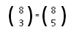
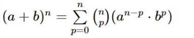

# Calculo de Coeficientes Binomiais

Um simples código em C que calcula os coeficientes binomiais usando dois métodos diferentes: um método analítico e outro pela relação de Stifel. O programa permite que o usuário insira dois números inteiros positivos menores ou iguais a 20 e calcula os coeficientes binomiais correspondentes.

## Método Analítico:

O método analítico para calcular os coeficientes binomiais é baseado na fórmula matemática:

### Casos especiais:

#### Binômios particulares:

#### Binomiais Complementares:

## Relação de Stifel:

## Binômio de Newton:

