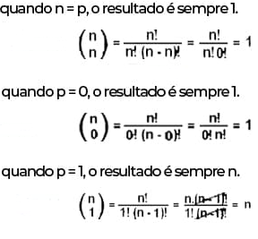

# Calculo de Coeficientes Binomiais

Um simples código em C que calcula os coeficientes binomiais usando dois métodos diferentes: cálculo pelo método analítico e pela relação de Stifel. Ao inserir dois valores inteiros positivos menores ou iguais a 20, os coeficientes binomiais correspondentes são calculados.

##  Método Analítico:

O método analítico para calcular os coeficientes binomiais é baseado na fórmula matemática:

### Casos especiais:

####      Binômios particulares:

## Relação de Stifel:

