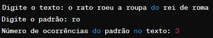

# Algoritmo de Busca de Padrão KMP

Este programa implementa o algoritmo de busca de padrão KMP (Knuth-Morris-Pratt) para encontrar todas as ocorrências de um padrão em um texto.

## Funcionamento

O algoritmo de busca de padrão KMP é uma técnica eficiente para localizar todas as ocorrências de um
padrão em um texto por utilizar uma função auxiliar chamada LPS (Longest Proper Prefix),
determinando os deslocamentos máximos que podem ser feitos quando uma comparação é falha. 
Isso evita comparações que não são necessárias, tornando o algoritmo eficiente, especialmente para padrões longos.

## Exemplo

- "O rato roeu a roupa do rei de roma";
  - Procurar "ro";
    - O programa deve retornar 3, indicando que o padrão "ro" ocorre três vezes na frase.
    - 
    
Certifique-se de fornecer entradas válidas e seguir o padrão especificado para evitar comportamento inesperado.
