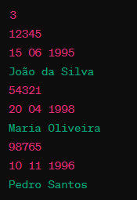

# **Organizador de Alunos**

Este programa em C permite organizar um grupo de alunos com base em diferentes critérios, como RA, data de nascimento e nome.

### Padrão de Entrada:

O programa espera a entrada dos dados dos alunos no seguinte formato:

1. Número de alunos (um número inteiro).
2. Para cada aluno:
    - RA (um número inteiro).
    - Data de nascimento no formato dia/mês/ano (três números inteiros separados por espaço).
    - Nome do aluno (uma string de até 60 caracteres, incluindo espaços em branco).

Por exemplo:

### Critérios de Organização:

O usuário pode escolher entre três critérios de organização:

- **R**: Ordenar por RA (Registro Acadêmico).
- **D**: Ordenar por data de nascimento.
- **N**: Ordenar por nome.

Após a execução, o programa imprimirá os alunos organizados de acordo com o critério selecionado.

### Observações:

- Certifique-se de fornecer entradas válidas de acordo com o padrão especificado.

