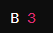
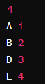
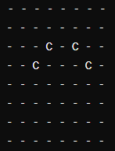

# Posição dos Cavalos e Cavalos em Guerra

Este repositório contém dois programas em C: `posicaoCavalo.c` e `cavalosEmGuerra.c`, que tratam do posicionamento de cavalos em um tabuleiro de xadrez e da detecção de cavalos em guerra.

## posicaoCavalo.c

Este programa solicita ao usuário a posição de um cavalo no tabuleiro de xadrez e imprime as 
posições para onde o cavalo pode se mover consideração seu movimento em forma de L.

A `entrada` para este programa consiste na posição inicial do cavalo no formato `<Coluna> <Linha>`, 
onde `<Coluna>` é uma letra de 'A' a 'H' representando a coluna e `<Linha>` é um número de 1 a 8 
representando a linha.

- Determina as posições para onde um cavalo pode se mover no tabuleiro de xadrez.
- Verifica se o cavalo pode realizar o movimento em uma dada posição, considerando os limites do tabuleiro.

A `saída` consiste nas posições válidas para onde o cavalo pode se mover a partir da posição inicial fornecida.
#### ------------------------------------------------------
## cavalosEmGuerra.c

Este programa simula uma situação em que vários cavalos são posicionados aleatoriamente em um tabuleiro de xadrez e verifica se algum cavalo está em posição de atacar outro.

A `entrada` para este programa é o número de cavalos a serem posicionados no tabuleiro, seguido das posições de cada cavalo no formato `<Coluna> <Linha>`.

- Cria um tabuleiro de xadrez e posiciona os cavalos de acordo com as entradas fornecidas.
- Verifica se algum cavalo pode atacar outro de acordo com as regras do jogo.

A `saída` indica se os cavalos estão em guerra ou se há paz no reino, seguida da representação do tabuleiro de xadrez com a posição dos cavalos.
Exemplo de tabuleiro com 4 cavalos:

